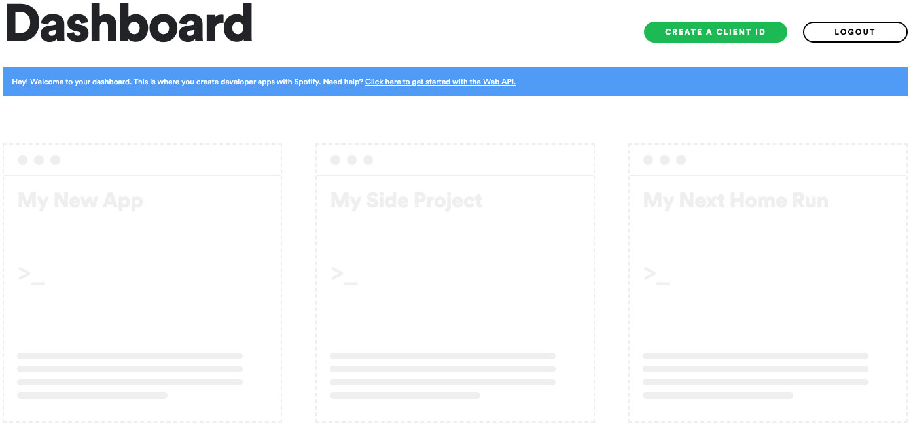
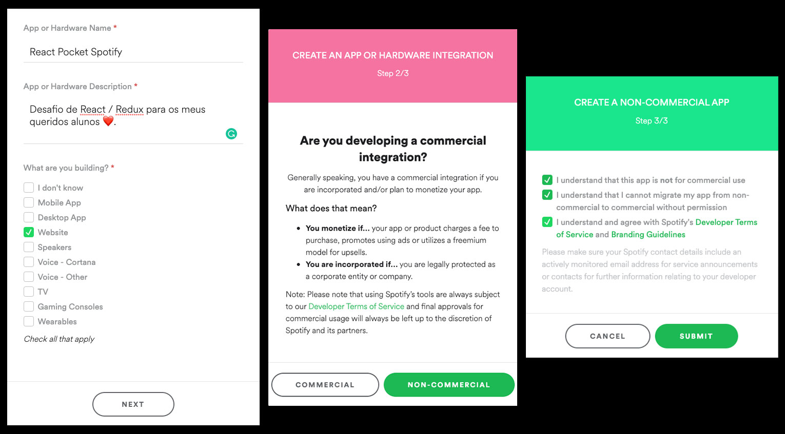
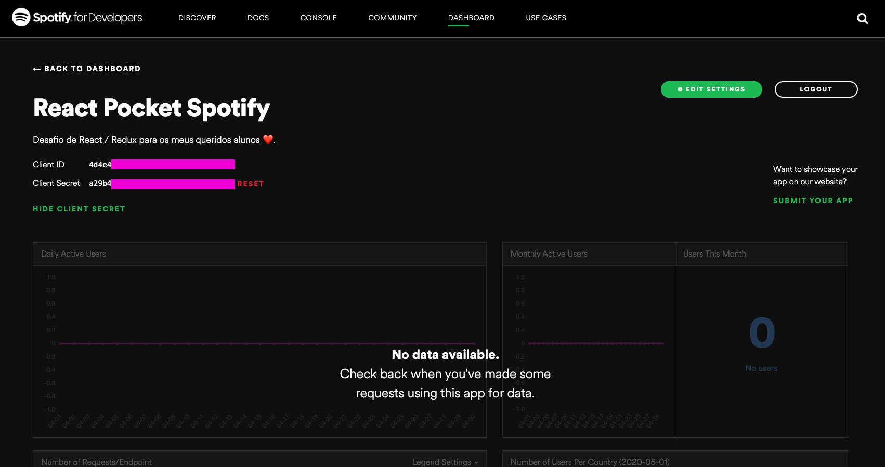
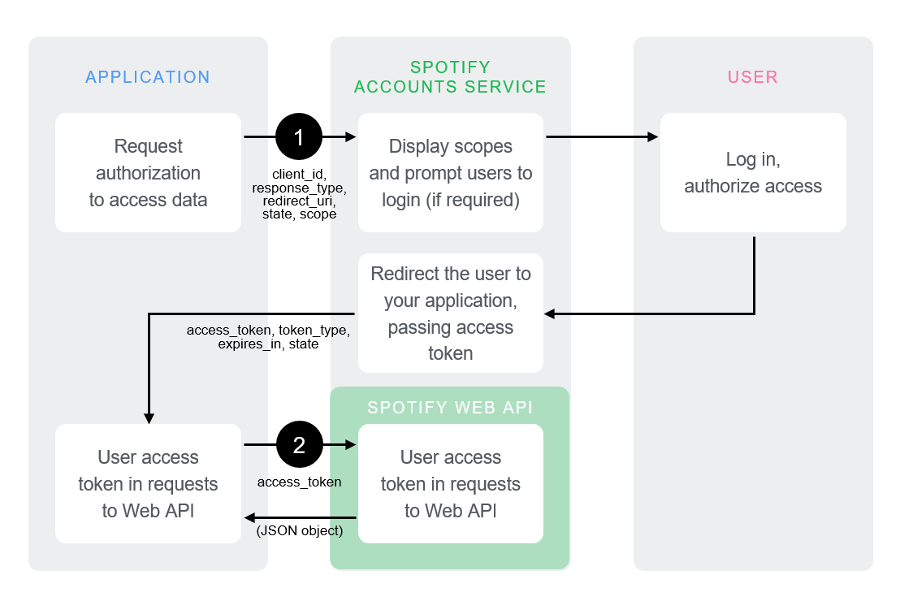

# Pocket Spotify SPA

## Objetivo:
O desafio desta semana e da próxima será desenvolver um `SPA (Single Page Application)` mobile-first do **Spotify** em React, consumindo diretamente a `Web API` do Spotify [https://developer.spotify.com/documentation/web-api](https://developer.spotify.com/documentation/web-api):

## Spotify Web API:
Para conseguir desenvolver o projeto, primeiro será necessário seguir os seguintes passos:
#### 1) Criar uma conta no Spotify
> Para utilizar a Web API, é necessário que você tenha uma conta de usuário (Premium ou Gratuita).
> Para criar a sua conta gratuita acesse [www.spotify.com](www.spotify.com).
> Após a criação da conta, acesse a página `Dashboard` e se necessário efetue o log in e aceite os termos de serviço
>

#### 2) Registrar o Aplicativo
> Como nosso APP não possui fins comerciais, preencha as informações do seu projeto de acordo com a imagem abaixo:

> Ao concluir o registro da sua aplicação você será redirecionado(a) para página de analytics do `React Pocket Spotify` onde serão revelados os tokens de `Client ID` e `Client Secret`. Você precisará deles para fazer as requisições ao Spotify Web API.
>
>

## Fluxo de autenticação
> O fluxo implícito de concessão é para `clientes` implementados inteiramente usando JavaScript e em execução no navegador do proprietário do recurso.
>

## Dependências
* node-sass
* react-redux
* react-router-dom
* redux
* redux-persist

## Requisitos:
* **[Node v13.8.0](https://nodejs.org/en/)** - ou superior, instalado em seu computador.
* **[Create React App](https://github.com/facebook/create-react-app)**
